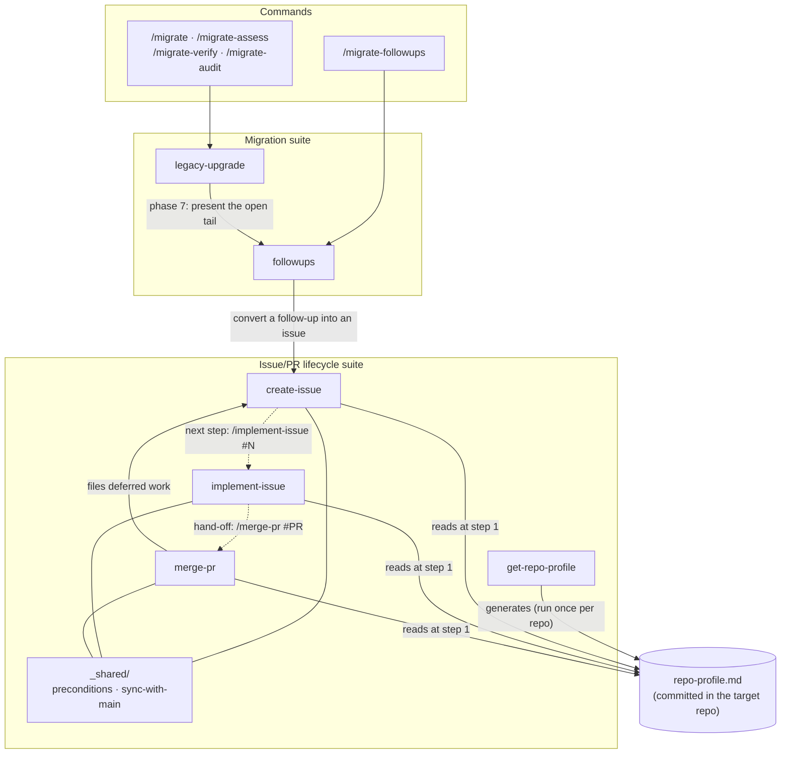
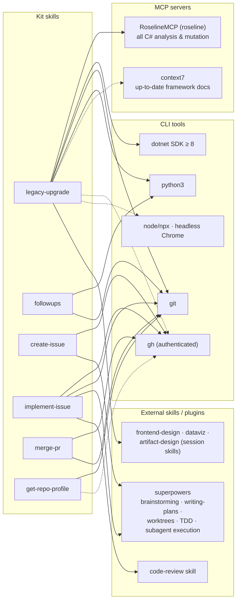

# Architecture

One plugin, two cooperating suites — the **migration pipeline** (legacy-upgrade, followups) and the
**issue/PR lifecycle** (create-issue, implement-issue, merge-pr, get-repo-profile) — bridged where a
migration's deferred work becomes tracked GitHub issues. Every skill carries
`metadata.suite: ai-migration-kit` in its frontmatter; in Claude Code the plugin namespaces them as
`ai-migration-kit:<skill>`.

## Skill call graph — who calls whom

Solid arrows = one skill invokes / hands off to another. Dashed = suggested next step.
The cylinder is shared **data**, not a skill: the committed per-repo profile.

The `followups → create-issue → implement-issue → merge-pr → create-issue` chain is deliberate:
`merge-pr` files the follow-ups it discovers, which feeds the queue again — the backlog stays
truthful instead of evaporating in chat.

## External dependencies — MCP servers, plugins, tools

Solid = required (the skill stops or degrades hard without it). Dashed = recommended
(documented degradation). Canonical machine-readable source: [`requirements.json`](requirements.json),
verified by `scripts/preflight.sh` at phase 0; entries hard-required by a specific skill carry a
`requiredBy` list, cross-checked in CI against that skill's `compatibility` frontmatter by
`tests/skills/check-frontmatter.py` — so the manifest and the distributed metadata cannot drift
apart silently.

## Dependency matrix

| Skill | MCP | External skills | CLI tools | Kit scripts |
|---|---|---|---|---|
| `legacy-upgrade` | **roseline** (required) · context7 (rec.) | frontend-design, dataviz, artifact-design (session) | **dotnet ≥ 8**, **git**, **python3** · gh, node, Chrome (rec.) | `preflight.sh`, `audit-inventory.sh`, `report-dashboard.py`, `contrast-check.py` |
| `followups` | — | — | **python3**, **git** | `followups.py`, `report-dashboard.py` |
| `create-issue` | — | superpowers (brainstorming, writing-plans) | **gh** | — |
| `implement-issue` | — | superpowers (worktrees, TDD, subagent/executing-plans, verification, receiving-code-review) · code-review | **gh**, **git** | — |
| `merge-pr` | — | superpowers (receiving-code-review) | **gh** (merge rights), **git** | — |
| `get-repo-profile` | — | — | **git**, bash · gh (degraded TODOs without) | `repo-profile.sh` (bundled in the skill) |

**Bold = required.** The lifecycle trio additionally *reads* `.claude/skills/repo-profile.md` in the
target repo — generated once by `get-repo-profile`, committed, then consumed with a plain `cat`.

## Where each concern lives

| Concern | Single source |
|---|---|
| Prerequisites (runtime check) | `requirements.json` (levels + per-skill `requiredBy`) → `scripts/preflight.sh` (phase 0) |
| Prerequisites (distribution) | each SKILL.md's `compatibility` frontmatter |
| Repo-specific facts for the lifecycle trio | `.claude/skills/repo-profile.md` (per target repo) |
| Migration state & follow-up queue | `migration/report.json` per migrated repo (never a parallel list) |
| Triggering contracts | `tests/skills/<name>.triggers.md`, guarded by `tests/skills/check-frontmatter.py` in CI |
