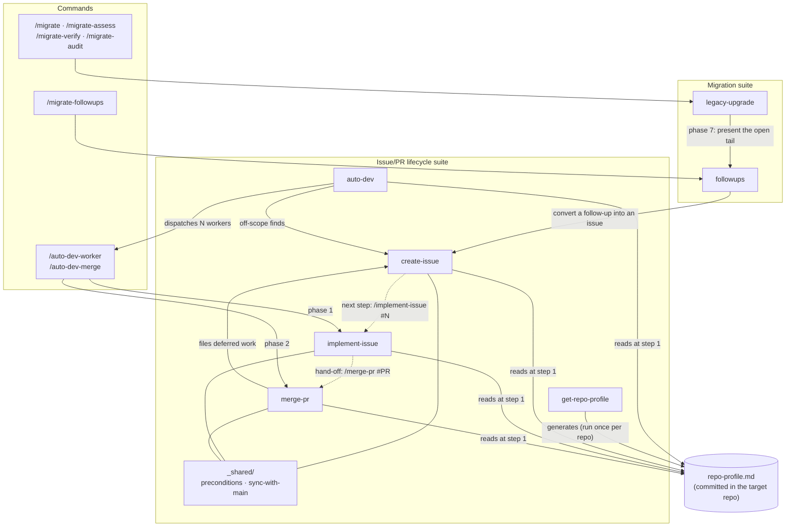
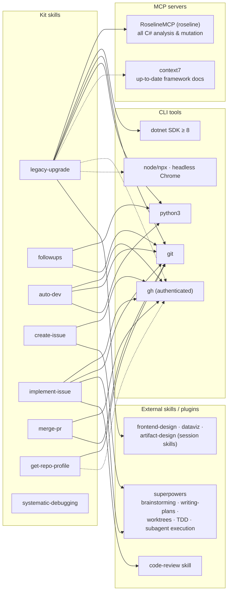

# Architecture

One plugin, two cooperating suites — the **migration pipeline** (legacy-upgrade, followups) and the
**issue/PR lifecycle** (create-issue, implement-issue, merge-pr, get-repo-profile, and the `auto-dev`
fleet supervisor above them) — bridged where a
migration's deferred work becomes tracked GitHub issues. Every skill carries
`metadata.suite: ai-migration-kit` in its frontmatter; in Claude Code the plugin namespaces them as
`ai-migration-kit:<skill>`.

## Skill call graph — who calls whom

Solid arrows = one skill invokes / hands off to another. Dashed = suggested next step.
The cylinder is shared **data**, not a skill: the committed per-repo profile.

```mermaid
graph TD
    subgraph commands ["Commands"]
        M["/migrate · /migrate-assess<br>/migrate-verify · /migrate-audit"]
        MF["/migrate-followups"]
        AW["/auto-dev-worker<br>/auto-dev-merge"]
    end

    subgraph migration ["Migration suite"]
        LU[legacy-upgrade]
        FU[followups]
    end

    subgraph lifecycle ["Issue/PR lifecycle suite"]
        AD[auto-dev]
        CI[create-issue]
        II[implement-issue]
        MP[merge-pr]
        RP[get-repo-profile]
        SH["_shared/<br>preconditions · sync-with-main"]
    end

    PROF[("repo-profile.md<br>(committed in the target repo)")]

    M --> LU
    MF --> FU
    LU -- "phase 7: present the open tail" --> FU
    FU -- "convert a follow-up into an issue" --> CI
    CI -. "next step: /implement-issue #N" .-> II
    II -. "hand-off: /merge-pr #PR" .-> MP
    MP -- "files deferred work" --> CI
    AD -- "dispatches N workers" --> AW
    AW -- "phase 1" --> II
    AW -- "phase 2" --> MP
    AD -- "off-scope finds" --> CI
    AD -- "reads at step 1" --> PROF
    RP -- "generates (run once per repo)" --> PROF
    CI -- "reads at step 1" --> PROF
    II -- "reads at step 1" --> PROF
    MP -- "reads at step 1" --> PROF
    CI --- SH
    II --- SH
    MP --- SH
```

The `followups → create-issue → implement-issue → merge-pr → create-issue` chain is deliberate:
`merge-pr` files the follow-ups it discovers, which feeds the queue again — the backlog stays
truthful instead of evaporating in chat.

## External dependencies — MCP servers, plugins, tools

Solid = required (the skill stops or degrades hard without it). Dashed = recommended
(documented degradation). Canonical machine-readable source: [`requirements.json`](requirements.json),
verified by `scripts/preflight.sh` at phase 0; entries hard-required by a specific skill carry a
`requiredBy` list, cross-checked in CI against that skill's `compatibility` frontmatter by
`tests/skills/check-frontmatter.py` — so the manifest and the distributed metadata cannot drift
apart silently.

```mermaid
graph LR
    subgraph skills ["Kit skills"]
        LU[legacy-upgrade]
        FU[followups]
        AD[auto-dev]
        CI[create-issue]
        II[implement-issue]
        MP[merge-pr]
        RP[get-repo-profile]
        SD[systematic-debugging]
    end

    subgraph mcp ["MCP servers"]
        ROS["RoselineMCP (roseline)<br>all C# analysis & mutation"]
        C7["context7<br>up-to-date framework docs"]
    end

    subgraph ext ["External skills / plugins"]
        SP["superpowers<br>brainstorming · writing-plans ·<br>worktrees · TDD · subagent execution"]
        CR["code-review skill"]
        FD["frontend-design · dataviz ·<br>artifact-design (session skills)"]
    end

    subgraph tools ["CLI tools"]
        GH["gh (authenticated)"]
        DN["dotnet SDK ≥ 8"]
        PY["python3"]
        GIT["git"]
        NODE["node/npx · headless Chrome"]
    end

    LU --> ROS
    LU --> DN
    LU --> GIT
    LU --> PY
    LU -.-> C7
    LU -.-> GH
    LU -.-> NODE
    LU --> FD

    FU --> PY
    FU --> GIT

    CI --> GH
    CI --> SP

    II --> GH
    II --> GIT
    II --> SP
    II --> CR

    MP --> GH
    MP --> GIT

    RP --> GIT
    RP -.-> GH

    AD --> GH
    AD --> GIT
    AD --> PY
```

`systematic-debugging` (SD) has no external dependency at all — it is a pure process skill, which is
why no arrow leaves it.

## Dependency matrix

| Skill | MCP | External skills | CLI tools | Kit scripts |
|---|---|---|---|---|
| `legacy-upgrade` | **roseline** (required) · context7 (rec.) | frontend-design, dataviz, artifact-design (session) | **dotnet ≥ 8**, **git**, **python3** · gh, node, Chrome (rec.) | `preflight.sh`, `audit-inventory.sh`, `report-dashboard.py`, `contrast-check.py` |
| `followups` | — | — | **python3**, **git** | `followups.py`, `report-dashboard.py` |
| `create-issue` | — | superpowers (brainstorming, writing-plans) | **gh** | — |
| `implement-issue` | — | superpowers (worktrees, TDD, subagent/executing-plans, verification, receiving-code-review) · code-review | **gh**, **git** | — |
| `merge-pr` | — | superpowers (receiving-code-review) | **gh** (merge rights), **git** | — |
| `auto-dev` | — | drives create-issue, implement-issue, merge-pr · `loop` (heartbeat) | **gh** (merge rights), **git** · python3 (cost reports) | `survey.sh`, `reconcile.sh`, `wait-ci.sh`, `usage_report.py`, `analyze_cache.py`, `measure_phase2.py` (bundled in the skill) |
| `systematic-debugging` | — | — | — | `find-polluter.sh` (bundled in the skill) |
| `get-repo-profile` | — | — | **git**, bash · gh (degraded TODOs without) | `repo-profile.sh` (bundled in the skill) |

**Bold = required.** The lifecycle trio — and `auto-dev` above them — additionally *reads*
`.claude/skills/repo-profile.md` in the target repo — generated once by `get-repo-profile`,
committed, then consumed with a plain `cat`.

## Where each concern lives

| Concern | Single source |
|---|---|
| Prerequisites (runtime check) | `requirements.json` (levels + per-skill `requiredBy`) → `scripts/preflight.sh` (phase 0) |
| Prerequisites (distribution) | each SKILL.md's `compatibility` frontmatter |
| Repo-specific facts for the lifecycle trio | `.claude/skills/repo-profile.md` (per target repo) |
| Migration state & follow-up queue | `migration/report.json` per migrated repo (never a parallel list) |
| Triggering contracts | `tests/skills/<name>.triggers.md`, guarded by `tests/skills/check-frontmatter.py` in CI |
| Version | `.claude-plugin/plugin.json`, bumped by release-please — **never** a `metadata.version` in a SKILL.md |

## Versioning

The plugin ships as one unit: there is no way to install `legacy-upgrade` at one version alongside
`merge-pr` at another, so a per-skill version would communicate a granularity that does not exist —
and nothing would bump it. Six of them had already drifted behind `plugin.json` before the field was
removed (#16).

`check-frontmatter.py` enforces this by **parsing** the frontmatter: a `version` key is rejected at
top level and under `metadata`, in every YAML spelling (`version:`, `"version":`, `version :`, the
flow form `metadata: {version: 1}`). Pattern-matching got this wrong in both directions — it missed
the quoted spellings and fired on prose inside a `>-` block — so `tests/skills/test.sh` drives the
checker over fixtures that must be rejected. Without it the rule is unfalsifiable: every real skill
already satisfies an absence rule, so a guard that stopped matching would keep printing "OK".

Skill metadata keeps `author` and `suite` — stable facts rather than claims about a release — and
both are required by the same checker, so this paragraph is not itself an unmaintained claim.
