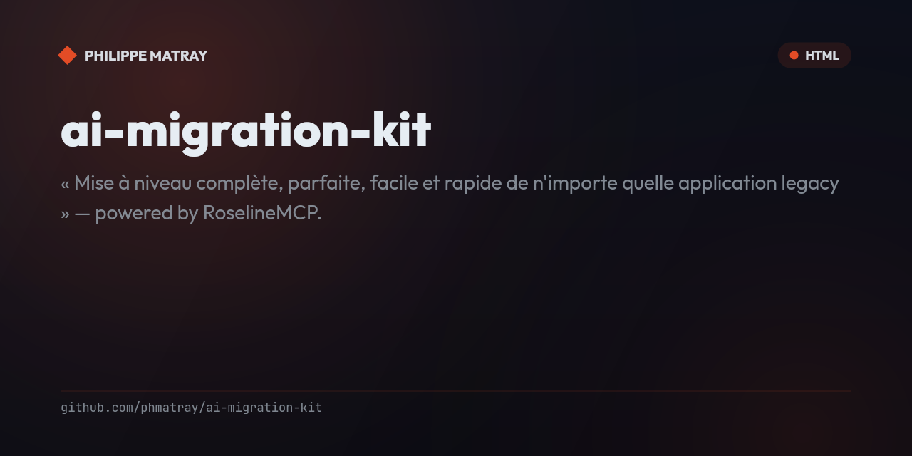

# AI Migration Kit

<!-- portfolio-badges:start -->
<!-- Identity -->
[](https://github.com/phmatray/ai-migration-kit)

[](https://github.com/phmatray/ai-migration-kit/stargazers)
[](https://github.com/phmatray/ai-migration-kit/network/members)
[](https://github.com/phmatray/ai-migration-kit/blob/HEAD/LICENSE)

<!-- Activity -->
[](https://github.com/phmatray/ai-migration-kit/issues)
[](https://github.com/phmatray/ai-migration-kit/pulls)
[](https://github.com/phmatray/ai-migration-kit/commits)
<!-- portfolio-badges:end -->

<!-- portfolio-toc:start -->

## Table of Contents

- [Proven in production](#proven-in-production)
- [Prerequisites](#prerequisites)
- [Install](#install)
- [Quickstart](#quickstart)
- [The audit product — `/migrate-audit`](#the-audit-product--migrate-audit)
- [The pipeline](#the-pipeline)
- [The issue/PR lifecycle skills](#the-issuepr-lifecycle-skills)
- [Safety rails](#safety-rails)
- [Repository layout](#repository-layout)
- [Proof it works](#proof-it-works)
- [Tech Stack](#tech-stack)
- [Contributing](#contributing)

<!-- portfolio-toc:end -->


> « Mise à niveau complète, parfaite, facile et rapide de n'importe quelle application legacy » — powered by **RoselineMCP**.

A Claude Code plugin that upgrades legacy .NET applications through a seven-phase, gate-verified pipeline that ends in verified production. RoselineMCP (a Roslyn-powered MCP server) is the engine for every C# analysis and transformation step: solution diagnostics, bulk code fixes, surgical member edits, safe renames, and impact analysis via references and call graphs.

- **Complete** — from first assessment to a verified migration report, not just a csproj bump.
- **Verified** — every phase ends at a gate (build, tests, diagnostics baseline); a red gate stops the pipeline.
- **Easy** — one command: `/migrate`. Start read-only with `/migrate-assess`.
- **Fast** — mechanical fixes are applied in bulk with Roslyn code fixes; agent time is spent only on judgment calls.

## Proven in production

Four dead-platform apps (WinRT 8.x, Windows Phone, UWP) audited, migrated to Blazor WebAssembly
and **verified live** with this kit — characterization tests first, legacy data and art byte-for-byte,
measured WCAG AA, offline proven with the network cut, and a permanent post-deploy smoke test:

| App (2013–2016) | Live | Audit estimate | Measured pipeline time |
|---|---|---|---|
| Sokoban (WinRT 8.1) | [phmatray.github.io/winrt-sokoban](https://phmatray.github.io/winrt-sokoban/) | 13 j | vague 1 |
| Chords (Windows Phone) | [phmatray.github.io/chords](https://phmatray.github.io/chords/) | 13 j | **18 min** |
| Les Fleurs du Mal (WinRT 8.1) | [phmatray.github.io/fleurs-du-mal-winrt](https://phmatray.github.io/fleurs-du-mal-winrt/) | 18 j | **~30 min** |
| Pokédex G (UWP + SQLite 49 MB) | [phmatray.github.io/pokedexg](https://phmatray.github.io/pokedexg/) | 29 j | **~1 h** |

Full portfolio audit, per-app reports and the lessons each wave fed back into the kit:
[docs/case-studies/winrt-portfolio/](docs/case-studies/winrt-portfolio/) and [CHANGELOG.md](CHANGELOG.md).

## Prerequisites

The canonical list — required and recommended tools, MCP servers and session skills — lives in
[`requirements.json`](requirements.json), the single source that `scripts/preflight.sh` (phase 0)
reads and verifies. In short: [Claude Code](https://code.claude.com) with **RoselineMCP** connected
(`claude mcp list` should show `roseline`), a .NET SDK (latest LTS recommended), git, python3 — and
the target application in a git repository.

## Install

```bash
claude plugin marketplace add phmatray/ai-migration-kit   # or the local path to this repo
claude plugin install ai-migration-kit
```

## Quickstart

```text
cd your-legacy-app
claude
> /migrate-assess          # read-only audit → migration/assessment.md
> /migrate                 # full pipeline (phases 1–7, through verified production)
> /migrate-verify          # re-runnable final quality gate
```

## The audit product — `/migrate-audit`

The kit's front door: a **read-only executive audit** that speaks to decision-makers, not just developers. For each target app it delivers a costed report — technology era, UI surface, platform-API mapping, share of business logic that ports as-is, effort estimate in days (transparent formula, ±30%), recommended target (Blazor WASM/Server/Hybrid), risk register and cost of inaction. Point it at several apps and it adds a **portfolio synthesis**: value/effort matrix, migration order, first wave. Every number comes from `scripts/audit-inventory.sh` (reproducible JSON), and it also covers dead-platform apps (WinRT, UWP, Windows Phone → Blazor) where the question is UI rewrite + logic porting, not a TFM bump. See the real case study: [docs/case-studies/winrt-portfolio/](docs/case-studies/winrt-portfolio/).

## The pipeline

| # | Phase | Purpose | Key RoselineMCP tools | Exit gate |
|---|-------|---------|----------------------|-----------|
| 1 | **Assess** | Read-only inventory: TFMs, packages, diagnostics, risk map | `analyze_solution`, `search_symbols` | `migration/assessment.md` written, zero files touched |
| 2 | **Baseline** | Build + tests green; characterization tests where coverage is missing | `get_call_graph`, `analyze_solution` | Green build + tests, baseline recorded |
| 3 | **Retarget** | Bump TFMs and packages in dependency order | `get_symbol_at_position`, `find_references` | Solution builds on the new TFM |
| 4 | **Remediate** | Drive diagnostics to zero errors; bulk-fix mechanical issues | `list_diagnostics`, `apply_fixes`, `edit_member` | 0 errors, warnings ≤ baseline, tests green |
| 5 | **Modernize** | Opt-in idiom upgrades (nullable, async, file-scoped namespaces) | `find_references`, `rename_symbol`, `edit_member` | Build + tests green after each item |
| 6 | **Verify** | Final gate + generated executive dashboard | `analyze_solution` | `migration/report.html` (generated) + `report.md`, all green |
| 7 | **Deliver** | CI + deployment from kit templates, production verified | — | public URL answers on deep routes, screenshot reviewed |

A **phase 0 preflight** (`scripts/preflight.sh`, `--json` for machine output) gates the whole pipeline. It reads the prerequisite manifest [`requirements.json`](requirements.json) — the single source for required/recommended tools, MCP servers and session skills: required items hard-fail; recommended capabilities degrade **loudly** — every absence is recorded in the report with the fallback used, and entries a specific skill hard-requires carry a `requiredBy` list that skill enforces at its own preconditions step. Session-level skills (the manifest's `sessionSkills`) are confirmed by the agent itself at phase 0.

Two properties fall out of the gate discipline. **Resume**: re-running `/migrate` on an interrupted migration never starts over — the gate commits and `migration/` artifacts locate the last green gate, and the pipeline re-enters at the phase after it. **Measured time**: the per-phase timeline in `migration/report.json` (`phases[]`, rendered by the report dashboard) is derived from the gate commits — the minutes this README advertises are a generated fact, not a stopwatch.

## The issue/PR lifecycle skills

The kit also ships four generic GitHub workflow skills — usable on any repo, not just migrations:

| Skill | Job |
|---|---|
| `create-issue` | File a template-compliant issue whose body carries a brainstorm → spec → implementation-plan trail with tickable task checkboxes. |
| `implement-issue` | Execute an issue's plan: worktree, draft PR, one commit per task with live checkbox ticking, code review, sync with `main`, ready-flip. |
| `merge-pr` | Land a ready PR: wait for CI, clear blockers (red checks, conflicts, review) in a corrections loop, squash-merge, file follow-ups, tear down. |
| `get-repo-profile` | Generate or read `.claude/skills/repo-profile.md` — the config the three skills above consume. Run once per repo, commit the profile. |

Every repo-specific fact (commit identity, build/test commands, label taxonomy, merge style,
conflict hot-spots) lives in that committed per-repo profile — the skills themselves stay portable
(`skills/_shared/` holds their common procedures). They are the natural tail of a migration:
phase 7's `followups` queue hands items that deserve a real ticket to `create-issue` (the report
keeps the issue URL), then `implement-issue` and `merge-pr` burn them down. Their dependencies
(authenticated `gh`, the superpowers skill set, a code-review skill) are declared in
[`requirements.json`](requirements.json). Call graph and full dependency matrix:
[ARCHITECTURE.md](ARCHITECTURE.md).

## Safety rails

- Dedicated `migration/<date>` branch; commit at every green gate.
- All RoselineMCP mutations run **preview-first**; diffs are inspected before `previewOnly: false`.
- A failed gate stops forward progress — fix or roll back, never skip.

## Repository layout

```
.claude-plugin/         plugin + marketplace manifests
ARCHITECTURE.md         skill call graph + dependency matrix (mermaid)
requirements.json       single source for prerequisites (tools, MCPs, session skills) — read by preflight.sh
commands/               /migrate, /migrate-assess, /migrate-verify, /migrate-audit, /migrate-followups
skills/legacy-upgrade/  the pipeline orchestrator + phase references + playbooks
skills/followups/       consolidated follow-up queue across migrated repos, updated at the source
skills/create-issue/    generic issue/PR lifecycle: seeded issue (brainstorm → spec → plan)
skills/implement-issue/ generic issue/PR lifecycle: plan → draft PR → ready
skills/merge-pr/        generic issue/PR lifecycle: CI wait, corrections loop, squash-merge, follow-ups
skills/get-repo-profile/ the per-repo profile generator the lifecycle skills consume
skills/_shared/         procedures shared by the lifecycle skills (preconditions, sync-with-main)
scripts/                preflight.sh (phase-0 gate) · audit-inventory.sh (JSON inventory) · report-dashboard.py (report generator) · contrast-check.py (WCAG AA gate) · followups.py (open-tail aggregator)
templates/              ci-dotnet.yml + deploy-pages-blazor.yml — CI/deployment a migration drops into the target repo
tests/                  golden tests of the report generator, followups aggregator and preflight (CI-run)
samples/LegacyShop/     deliberately-legacy .NET solution (demo fixture, CI-guarded)
docs/case-studies/      real audits and migrations, with generated dashboards
docs/demo-walkthrough.md  a real pipeline run, with captured RoselineMCP output
```

**Live proof:** [play the wave-1 migrated game](https://phmatray.github.io/winrt-sokoban/) — a 2014 WinRT app, dead since Windows 8.x, now a Blazor WASM PWA.

## Proof it works

See [docs/demo-walkthrough.md](docs/demo-walkthrough.md): a genuine run of the pipeline migrating `samples/LegacyShop` from out-of-support **net6.0** to **net10.0**, with real RoselineMCP diagnostics before/after and green tests at the end.

---

<!-- portfolio-techstack:start -->

## Tech Stack

- **.NET 6**
- xunit
- xunit.runner.visualstudio

<!-- portfolio-techstack:end -->

<!-- portfolio-roadmap:start -->

## Roadmap

Planned work and known limitations are tracked in the [open issues](https://github.com/phmatray/ai-migration-kit/issues). Contributions toward them are welcome.

<!-- portfolio-roadmap:end -->

<!-- portfolio-sections:start -->

## Contributing

Contributions are welcome. Open an issue first to discuss any significant change.

1. Fork the repository and create your branch (`git checkout -b feat/my-feature`)
2. Commit your changes (`git commit -m 'feat: ...'`)
3. Push the branch and open a Pull Request

<!-- portfolio-sections:end -->
