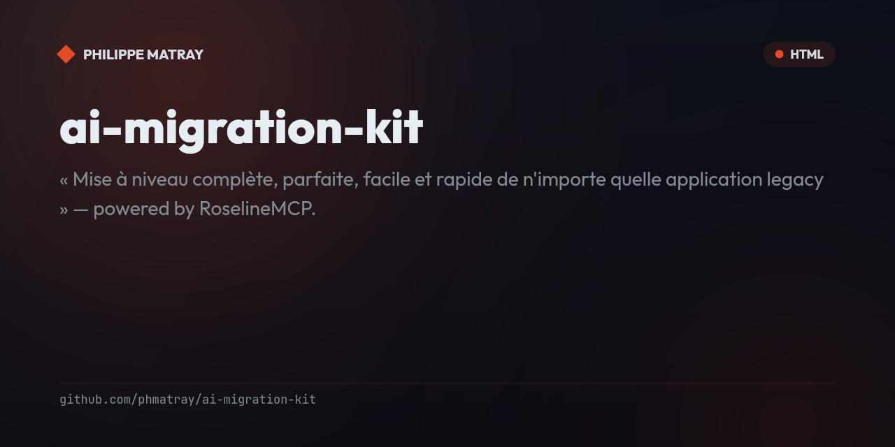

# AI Migration Kit

<!-- portfolio-badges:start -->
<!-- Identity -->
[](https://github.com/phmatray/ai-migration-kit)

[](https://github.com/phmatray/ai-migration-kit/stargazers)
[](https://github.com/phmatray/ai-migration-kit/network/members)
[](https://github.com/phmatray/ai-migration-kit/blob/HEAD/LICENSE)

<!-- Activity -->
[](https://github.com/phmatray/ai-migration-kit/issues)
[](https://github.com/phmatray/ai-migration-kit/pulls)
[](https://github.com/phmatray/ai-migration-kit/commits)
<!-- portfolio-badges:end -->

<!-- portfolio-toc:start -->

## Table of Contents

- [Proven in production](#proven-in-production)
- [Prerequisites](#prerequisites)
- [Install](#install)
- [Quickstart](#quickstart)
- [The audit product — `/migrate-audit`](#the-audit-product--migrate-audit)
- [The pipeline](#the-pipeline)
- [The issue/PR lifecycle skills](#the-issuepr-lifecycle-skills)
- [Desktop launcher](#desktop-launcher)
- [Safety rails](#safety-rails)
- [Repository layout](#repository-layout)
- [Proof it works](#proof-it-works)
- [Tech Stack](#tech-stack)
- [Contributing](#contributing)

<!-- portfolio-toc:end -->


> « Mise à niveau complète, parfaite, facile et rapide de n'importe quelle application legacy » — powered by **RoselineMCP**.

A Claude Code plugin that upgrades legacy .NET applications through a seven-phase, gate-verified pipeline that ends in verified production. RoselineMCP (a Roslyn-powered MCP server) is the engine for every C# analysis and transformation step: solution diagnostics, bulk code fixes, surgical member edits, safe renames, and impact analysis via references and call graphs.

- **Complete** — from first assessment to a verified migration report, not just a csproj bump.
- **Verified** — every phase ends at a gate (build, tests, diagnostics baseline); a red gate stops the pipeline.
- **Easy** — one command: `/migrate`. Start read-only with `/migrate-assess`.
- **Fast** — mechanical fixes are applied in bulk with Roslyn code fixes; agent time is spent only on judgment calls.

## Features

- **Seven-phase gated pipeline** — Assess → Baseline → Retarget → Remediate → Modernize → Verify → Deliver, each phase ending at a build/test/diagnostics gate before the next one starts.
- **RoselineMCP-powered C# analysis** — Roslyn-backed solution diagnostics, bulk code fixes, surgical member edits, safe renames and reference/call-graph impact analysis drive every transformation step.
- **Read-only executive audit** — `/migrate-audit` produces a costed report (effort in days, risk register, recommended target) per app, plus a portfolio value/effort synthesis across several apps.
- **Resumable migrations** — gate commits and `migration/` artifacts let an interrupted `/migrate` re-enter at the last green phase instead of starting over.
- **Generated executive dashboard** — phase 6 emits `migration/report.html` and `report.json` with measured per-phase timings derived from gate commits, not a manual stopwatch.
- **Issue/PR lifecycle skills** — portable `create-issue`, `implement-issue`, `merge-pr` and `get-repo-profile` skills usable on any repo, driven by a committed per-repo profile.
- **Backlog burn-down at scale** — `auto-dev` supervises a fleet of N parallel workers, each taking one issue from plan to merged PR, with conflict-avoiding area isolation and a measured token budget.
- **Root-cause debugging** — `systematic-debugging` fires before any fix is proposed, so a failure is explained before it is patched.
- **Preflight safety gate** — `scripts/preflight.sh` verifies required/recommended tools, MCP servers and session skills declared in `requirements.json` before phase 1 starts.
- **CI/deployment templates** — `templates/ci-dotnet.yml` and `templates/deploy-pages-blazor.yml` wire a migrated app straight into GitHub Actions and Pages. A repo that commits its front-end bundle can also arm the drift gate — see [docs/bundle-gate.md](docs/bundle-gate.md).

## Proven in production

Four dead-platform apps (WinRT 8.x, Windows Phone, UWP) audited, migrated to Blazor WebAssembly
and **verified live** with this kit — characterization tests first, legacy data and art byte-for-byte,
measured WCAG AA, offline proven with the network cut, and a permanent post-deploy smoke test:

| App (2013–2016) | Live | Audit estimate | Measured pipeline time |
|---|---|---|---|
| Sokoban (WinRT 8.1) | [phmatray.github.io/winrt-sokoban](https://phmatray.github.io/winrt-sokoban/) | 13 j | vague 1 |
| Chords (Windows Phone) | [phmatray.github.io/chords](https://phmatray.github.io/chords/) | 13 j | **18 min** |
| Les Fleurs du Mal (WinRT 8.1) | [phmatray.github.io/fleurs-du-mal-winrt](https://phmatray.github.io/fleurs-du-mal-winrt/) | 18 j | **~30 min** |
| Pokédex G (UWP + SQLite 49 MB) | [phmatray.github.io/pokedexg](https://phmatray.github.io/pokedexg/) | 29 j | **~1 h** |

Full portfolio audit, per-app reports and the lessons each wave fed back into the kit:
[docs/case-studies/winrt-portfolio/](docs/case-studies/winrt-portfolio/) and [CHANGELOG.md](CHANGELOG.md).

## Prerequisites

The canonical list — required and recommended tools, MCP servers and session skills — lives in
[`requirements.json`](requirements.json), the single source that `scripts/preflight.sh` (phase 0)
reads and verifies. In short: [Claude Code](https://code.claude.com) with **RoselineMCP** connected
(`claude mcp list` should show `roseline`), a .NET SDK (latest LTS recommended), git, python3 — and
the target application in a git repository.

### RoselineMCP is shipped *and* enforced

You do not need to `claude mcp add roseline` — the kit ships the server itself in
[`.mcp.json`](.mcp.json) (`dnx RoselineMCP --yes`), so installing the plugin installs the dependency.

> `dnx` ships with the **.NET 10 SDK**. The pipeline itself only needs `dotnet >= 8`, so on a
> .NET 8/9-only host the server does not launch — and the kit now says so instead of leaving you to
> deduce it. [`requirements.json`](requirements.json) records the server's own floor
> (`"requiresSdk": "10"`, higher than the pipeline's), phase 0 reports it as a **named degradation**
> rather than a green tick, and the gate below **fails open** whenever `dnx` is absent. So you are
> told what is missing and nothing is blocked in the meantime; install the .NET 10 SDK to get
> roseline itself.

It also **enforces** it. Preflight only ever proved roseline was *connected*; nothing made it
*used*, and in practice `Read`/`Grep` on a `.cs` file stayed the path of least resistance. So
[`hooks/roseline-gate.sh`](hooks/roseline-gate.sh) runs as a `PreToolUse` hook and **denies** `Read`
on a C# file, naming the roseline tool that replaces it (`search_symbols`, `get_symbol_info`,
`find_references`, …). An advisory reminder was tried first and does not work — the reminder arrives
together with the file content, so the model has already been paid by the time the advice lands.

Four properties keep that safe to have switched on:

- **Inert outside C# projects.** The gate walks *up* from the file looking for a
  `*.sln`/`*.slnx`/`*.csproj`, and no-ops when it finds none — so a globally-installed plugin never
  blocks reads in a repo that has no roseline.
- **A one-shot escape.** Issuing the *identical* `Read` again straight away is allowed through. It
  is consumed rather than latched (a third read denies again) and it expires, so a marker left
  behind by a deny you complied with cannot silently open the file hours later.
- **Fails open, always.** No `jq`, an unparseable payload, an unwritable `TMPDIR`, any internal
  error — the gate exits silently and the `Read` proceeds. It never fails closed.
- **It never enforces a tool that cannot be there.** No `dnx` on `PATH` means the shipped launcher
  cannot have started the server, so the `mcp__roseline__*` tools the deny message names do not
  exist — and the gate lets the `Read` through rather than pointing you at them. That probe is a
  proxy, and it errs in one direction only: it cannot see roseline started by any *other* route, so
  `ROSELINE_GATE=on` is there to say "it is running, enforce anyway" (see below).

`Grep` is deliberately left alone: roseline replaces whole-file reads, but `search_symbols` finds
*symbols*, and grepping a string literal or a comment in `.cs` is a real need it cannot serve.

**Editing a C# file.** `Edit` refuses a file the conversation has not `Read`, and roseline's
`edit_member`/`rename_symbol` cover member bodies and renames but not `using` directives,
file-scoped namespace conversion, attributes above a type, or top-level statements. For those, take
the escape: the denied `Read`, then the identical `Read` again, then `Edit`. The deny message says
so.

**To turn the gate off**, set `ROSELINE_GATE=off` in your environment (also `0`, `false`, `no`,
`disabled`). There is no `Read` matcher to remove from your own settings — the hook is supplied by
the plugin in [`hooks/hooks.json`](hooks/hooks.json), so the other levers are uninstalling the
plugin or Claude Code's global `disableAllHooks`.

**To turn it *on* regardless**, set `ROSELINE_GATE=on` (also `1`, `true`, `yes`, `enabled`). This is
for the case the `dnx` probe cannot settle: you are running roseline by some route other than the
shipped launcher — a hand-added MCP server, a locally built binary, a wrapper script — or `dnx` is
on your login shell's `PATH` but not on the narrower one Claude Code hands its hooks. Left alone,
the gate would fail open for you permanently and silently; `on` is your word that the server is
there, and enforcement resumes. `off` is still checked first and still wins, so a stale `on`
somewhere in your environment can never override an `off` you have set. Any other value is neither
switch and leaves the probe to decide.

> **Permission prompts are a separate concern.** A Claude Code plugin cannot ship `permissions`
> allow rules — only a settings file can. So if roseline's tool calls prompt you for Accept/Deny,
> add them to your own `~/.claude/settings.json` (or an org `managed-settings.json`) as **per-tool**
> entries, e.g. `mcp__roseline__search_symbols`. That is outside what this plugin can do for you.

## Install

```bash
claude plugin marketplace add phmatray/ai-migration-kit   # or the local path to this repo
claude plugin install ai-migration-kit
```

## Quickstart

```text
cd your-legacy-app
claude
> /migrate-assess          # read-only audit → migration/assessment.md
> /migrate                 # full pipeline (phases 1–7, through verified production)
> /migrate-verify          # re-runnable final quality gate
```

## The audit product — `/migrate-audit`

The kit's front door: a **read-only executive audit** that speaks to decision-makers, not just developers. For each target app it delivers a costed report — technology era, UI surface, platform-API mapping, share of business logic that ports as-is, effort estimate in days (transparent formula, ±30%), recommended target (Blazor WASM/Server/Hybrid), risk register and cost of inaction. Point it at several apps and it adds a **portfolio synthesis**: value/effort matrix, migration order, first wave. Every number comes from `scripts/audit-inventory.sh` (reproducible JSON), and it also covers dead-platform apps (WinRT, UWP, Windows Phone → Blazor) where the question is UI rewrite + logic porting, not a TFM bump. See the real case study: [docs/case-studies/winrt-portfolio/](docs/case-studies/winrt-portfolio/).

## The pipeline

| # | Phase | Purpose | Key RoselineMCP tools | Exit gate |
|---|-------|---------|----------------------|-----------|
| 1 | **Assess** | Read-only inventory: TFMs, packages, diagnostics, risk map | `analyze_solution`, `search_symbols` | `migration/assessment.md` written, zero files touched |
| 2 | **Baseline** | Build + tests green; characterization tests where coverage is missing | `get_call_graph`, `analyze_solution` | Green build + tests, baseline recorded |
| 3 | **Retarget** | Bump TFMs and packages in dependency order | `get_symbol_at_position`, `find_references` | Solution builds on the new TFM |
| 4 | **Remediate** | Drive diagnostics to zero errors; bulk-fix mechanical issues | `list_diagnostics`, `apply_fixes`, `edit_member` | 0 errors, warnings ≤ baseline, tests green |
| 5 | **Modernize** | Opt-in idiom upgrades (nullable, async, file-scoped namespaces) | `find_references`, `rename_symbol`, `edit_member` | Build + tests green after each item |
| 6 | **Verify** | Final gate + generated executive dashboard | `analyze_solution` | `migration/report.html` (generated) + `report.md`, all green |
| 7 | **Deliver** | CI + deployment from kit templates, production verified | — | public URL answers on deep routes, screenshot reviewed |

A **phase 0 preflight** (`scripts/preflight.sh`, `--json` for machine output) gates the whole pipeline. It reads the prerequisite manifest [`requirements.json`](requirements.json) — the single source for required/recommended tools, MCP servers and session skills: required items hard-fail; recommended capabilities degrade **loudly** — every absence is recorded in the report with the fallback used, and entries a specific skill hard-requires carry a `requiredBy` list that skill enforces at its own preconditions step. Session-level skills (the manifest's `sessionSkills`) are confirmed by the agent itself at phase 0.

Two properties fall out of the gate discipline. **Resume**: re-running `/migrate` on an interrupted migration never starts over — the gate commits and `migration/` artifacts locate the last green gate, and the pipeline re-enters at the phase after it. **Measured time**: the per-phase timeline in `migration/report.json` (`phases[]`, rendered by the report dashboard) is derived from the gate commits — the minutes this README advertises are a generated fact, not a stopwatch.

## The issue/PR lifecycle skills

The kit also ships six generic GitHub workflow skills — usable on any repo, not just migrations:

| Skill | Job |
|---|---|
| `create-issue` | File a template-compliant issue whose body carries a brainstorm → spec → implementation-plan trail with tickable task checkboxes. |
| `implement-issue` | Execute an issue's plan: worktree, draft PR, one commit per task with live checkbox ticking, code review, sync with `main`, ready-flip. |
| `merge-pr` | Land a ready PR: wait for CI, clear blockers (red checks, conflicts, review) in a corrections loop, squash-merge, triage follow-ups (cluster by root cause, fold into the issue that owns them, file at most 3), tear down. |
| `auto-dev` | Supervise a FLEET of N parallel workers over the whole backlog: survey and order the open issues, dispatch area-isolated workers (`implement-issue` → `merge-pr`), wait for CI, verify real merge state, refill each slot as a PR lands. |
| `triage-backlog` | Re-decide the issues already open: verify what's been fixed, cluster by root cause, then propose keep / sharpen / fold / rescope / close-by-decision for each — and execute only what the owner confirms. The outlet the three inlets above don't have. |
| `get-repo-profile` | Generate or read `.claude/skills/repo-profile.md` — the config the skills above consume. Run once per repo, commit the profile. |
| `setup-repo` | The write half of the profile story: bring a repo to the configuration those skills assume — label taxonomy, `.github/ISSUE_TEMPLATE/` forms, repo settings — from a declarative manifest. `plan` prints the drift and writes nothing; `apply` converges it, idempotently and additively. |

Every repo-specific fact (commit identity, build/test commands, label taxonomy, merge style,
conflict hot-spots) lives in that committed per-repo profile — the skills themselves stay portable
(`skills/_shared/` holds their common procedures). They are the natural tail of a migration:
phase 7's `followups` queue hands items that deserve a real ticket to `create-issue` (the report
keeps the issue URL), then `implement-issue` and `merge-pr` burn them down. Their dependencies
(authenticated `gh`, the superpowers skill set, a code-review skill) are declared in
[`requirements.json`](requirements.json). Call graph and full dependency matrix:
[ARCHITECTURE.md](ARCHITECTURE.md).

## Desktop launcher

[**AI Kit**](https://github.com/Atypical-Consulting/omarchy-aikit) runs these
skills from the [Omarchy](https://omarchy.org/) desktop instead of the command
line: pick a repository, pick a skill, and the session starts in a tmux terminal.
Issues and PRs are chosen from a list rather than typed as numbers, a bar widget
shows the sessions in flight and the PRs a background `auto-dev` fleet has
landed, and a cross-repo work queue answers "what should I work on?" — failing
CI, requested reviews, your open PRs, assigned and planned issues, across every
repository at once.

Menus read a local SQLite mirror of GitHub kept fresh by a systemd timer, so no
menu waits on the network.

```bash
omarchy plugin add https://github.com/Atypical-Consulting/omarchy-aikit.git --enable
```

## Safety rails

- Dedicated `migration/<date>` branch; commit at every green gate.
- All RoselineMCP mutations run **preview-first**; diffs are inspected before `previewOnly: false`.
- A failed gate stops forward progress — fix or roll back, never skip.

## Repository layout

```
.claude-plugin/         plugin + marketplace manifests
ARCHITECTURE.md         skill call graph + dependency matrix (mermaid)
requirements.json       single source for prerequisites (tools, MCPs, session skills) — read by preflight.sh
commands/               /migrate, /migrate-assess, /migrate-verify, /migrate-audit, /migrate-followups, /auto-dev-worker, /auto-dev-merge
skills/legacy-upgrade/  the pipeline orchestrator + phase references + playbooks
skills/followups/       consolidated follow-up queue across migrated repos, updated at the source
skills/create-issue/    generic issue/PR lifecycle: seeded issue (brainstorm → spec → plan)
skills/implement-issue/ generic issue/PR lifecycle: plan → draft PR → ready
skills/merge-pr/        generic issue/PR lifecycle: CI wait, corrections loop, squash-merge, follow-ups
skills/auto-dev/        fleet supervisor above the lifecycle skills: N parallel workers burning down the backlog
skills/triage-backlog/  the queue's outlet: verify, cluster and re-decide open issues — owner confirms every close
skills/systematic-debugging/ root-cause-before-fix process, harness-agnostic
skills/get-repo-profile/ the per-repo profile generator the lifecycle skills consume
skills/setup-repo/      the write half of that: plan/apply a repo's labels, issue forms and settings from a manifest
skills/_shared/         procedures shared by the lifecycle skills (preconditions, sync-with-main, filing-bar, worktree-ignore-check, untrusted-input-boundary, test-seams, grilling)
scripts/                preflight.sh (phase-0 gate) · run-all-tests.sh (one command for everything CI checks, exit 2 on a missing prerequisite) · audit-inventory.sh (JSON inventory) · report-dashboard.py (report generator) · contrast-check.py (WCAG AA gate) · followups.py (open-tail aggregator) · release-title-gate.sh + release-title-diff.sh (a change to shipped content must carry a title that cuts a release)
templates/              ci-dotnet.yml + deploy-pages-blazor.yml — CI/deployment a migration drops into the target repo · repo-setup.yml + issue-forms/ — the desired GitHub configuration setup-repo applies · bundle-gate.json.example — copy-pasteable config for the opt-in committed-bundle drift gate
tests/                  one golden suite per contract, each a tests/<name>/test.sh that CI runs — and a CI step fails the build if a suite is ever left unwired. Run them all with `./scripts/run-all-tests.sh`
samples/LegacyShop/     deliberately-legacy .NET solution (demo fixture, CI-guarded)
docs/case-studies/      real audits and migrations, with generated dashboards
docs/demo-walkthrough.md  a real pipeline run, with captured RoselineMCP output
docs/bundle-gate.md     what the opt-in committed-bundle drift gate measures, its validation rules, how to disable it
```

**Hardening a destructive operation.** `tests/tick-plan/` and `tests/guarded-git/` are not feature
tests — each one pins an incident post-mortem (a `gh api` pipeline that wiped live issue bodies; a
commit that landed in another agent's PR), and between them they set the convention this repo
follows: a guard script under `skills/<skill>/scripts/`, a golden test that exercises its **refusal**
path and not just its happy one, and a CI step that runs that test. Adding a call that can destroy
something? Follow that shape rather than calling the raw command.

**Live proof:** [play the wave-1 migrated game](https://phmatray.github.io/winrt-sokoban/) — a 2014 WinRT app, dead since Windows 8.x, now a Blazor WASM PWA.

## Proof it works

See [docs/demo-walkthrough.md](docs/demo-walkthrough.md): a genuine run of the pipeline migrating `samples/LegacyShop` from out-of-support **net6.0** to **net10.0**, with real RoselineMCP diagnostics before/after and green tests at the end.

---

<!-- portfolio-techstack:start -->

## Tech Stack

- **.NET 6**
- xunit
- xunit.runner.visualstudio

<!-- portfolio-techstack:end -->

<!-- portfolio-roadmap:start -->

## Roadmap

Planned work and known limitations are tracked in the [open issues](https://github.com/phmatray/ai-migration-kit/issues). Contributions toward them are welcome.

<!-- portfolio-roadmap:end -->

<!-- portfolio-sections:start -->

## Contributing

Contributions are welcome. Open an issue first to discuss any significant change.

1. Fork the repository and create your branch (`git checkout -b feat/my-feature`)
2. Commit your changes (`git commit -m 'feat: ...'`)
3. Push the branch and open a Pull Request

<!-- portfolio-sections:end -->
