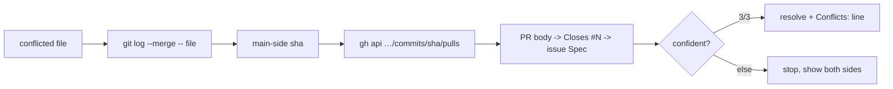

# Sync a branch with `main` and resolve conflicts

Shared procedure for the issue/PR lifecycle skills. `implement-issue` reads it before the ready-flip
(Step 8); `merge-pr` reads it in its corrections loop (Step 4) whenever the branch is stale — either
`behind_by > 0` against the base, or `mergeStateStatus` reports `DIRTY` (#171: `BEHIND` alone is not
the trigger, since GitHub only ever reports it under branch protection). The two skills add their own
trigger framing; the procedure itself lives **here**, once.

Throughout, `<commit-identity>` is the author line from the repo profile's *Commit identity*
(its `-c user.email=… -c user.name="…"` flags) — substitute it in the merge/commit commands so the
auto-created merge commit carries the right identity too (it's squashed away at landing, but the rule
still holds).

## Every write here is guarded

The three writes below — the merge, the commit that completes it, the push — go through the guards
in `implement-issue/scripts/`, never through bare `git`. They were the last unguarded writes in the
lifecycle (#41), and they are the biggest: a merge commit carries the whole of `main` into whatever
branch `HEAD` happens to name, and `git merge` no more checks that branch than `git commit` did in
the incident that motivated the guards (#26). The window is also the widest in the flow — resolving
conflicts can put minutes between the merge and the commit that finishes it — so both ends of it are
asserted rather than assumed.

Four names have to be in scope, and each skill sets them before it gets here:

```bash
BRANCH=<the branch this task owns>                 # implement-issue Step 4 · merge-pr Step 2
WORKTREE=<absolute path of that branch's worktree>
GUARDS=<the kit's skills/implement-issue/scripts directory>
BASE=<the branch to sync FROM>                     # implement-issue: main · merge-pr: baseRefName
```

If a guard call at `$GUARDS` is refused (an agent confined to `$WORKTREE`, `$GUARDS` resolving
outside it), see the fallback in [`guard-invocation.md`](./guard-invocation.md).

⚠️ **`$BASE` is not always `main`.** `implement-issue` branches off `main` and syncs from it, but
`merge-pr` captures `baseRefName` in its Step 1 precisely because a PR's base is only *normally*
`main` — plenty of repos default to `dev`, and release branches exist. Hardcoding `origin/main` here
would merge foreign commits into a PR based on something else, and leave `mergeStateStatus` stuck at
`BEHIND` because the actual base was never merged — a corrections loop that spins forever while every
command exits 0.

Pass `"$BRANCH"` **explicitly** every time: a guard that read the branch from `HEAD` would be reading
the very value it exists to check, and would agree with itself no matter which branch was checked
out. Pass `-C "$WORKTREE"` just as explicitly — the guards default to the current directory, which is
whatever checkout the session happens to be sitting in.

The identity flags go **before** `"$BRANCH"`; there they reach `git` itself. After `--` they would
reach the subcommand, which is a different (and wrong) option in both `git commit` and `git merge`.

---

## Why merge, not rebase

When the profile's *Integration style* is **squash-merge**, merge `main` into the branch — don't
rebase. The branch's history is collapsed to a single commit at landing anyway, so:

- a **merge** resolves each conflict **once**, needs **no force-push**, and the throwaway merge commit
  vanishes when the PR squashes;
- a **rebase** replays every conflict per-commit and needs `git push --force-with-lease` — only worth
  it if the repo actually rebases or merge-commits (follow the profile's *Integration style* then).

```bash
git -C "$WORKTREE" fetch origin "$BASE"
"$GUARDS/guarded-merge.sh" -C "$WORKTREE" <commit-identity> "$BRANCH" -- "origin/$BASE"
```

Raw `git fetch`/`git push` can be sandbox-blocked while `gh` works — see the profile's *Environment
gotchas* for the re-run-with-sandbox-disabled note. Local git (the merge itself, conflict resolution,
`commit`) needs no network.

**Read the guard's exit code — it is the branch of this procedure.** `git merge` answers `1` for a
conflict and for a handful of unrelated refusals alike, which is exactly why the guard separates them:

| Exit | Meaning | What to do |
|---:|---|---|
| `0` | merged, or already up to date — on `$BRANCH` | Skip to *Finish and verify*. Nothing to commit; the merge commit (if any) is already written. |
| `5` | **conflicts** — the normal outcome of a real sync, not an error | Resolve per the rule-of-thumb below, then *complete* the merge (never re-run it). |
| `2` | refused: `HEAD` is not `$BRANCH`, or is detached. **Nothing was merged.** | Stop. Get onto `$BRANCH` in a worktree of its own and retry — do not "just retry" from where you are. |
| `3` | the merge was written, but it landed on **another branch** | Stop and surface it. The message names the sha and the branch that took it; recovery is a human call. |
| other | git's own failure (bad ref, dirty tree…) | Read the `guarded-merge:` line — a git failure always says so — and fix the cause. |

A "no advance" is not a failure here: *already up to date* is the commonest result of a real sync, so
the guard reports the tip rather than demanding it move.

## Resolving conflicts — the rule-of-thumb

Most conflicts are mechanical and have one right answer. The profile's *Conflict hot-spots* table
lists them **per file** with the resolution for each — read it and resolve those yourself. The
resolution *shapes* it encodes, so you can reason about a file the table doesn't name:

- **union** additive files (docs, changelogs, test files, additive code) — keep **both** sides' new
  sections/methods/usings/tests; dropping a sibling PR's line loses real work, and the build catches a
  genuine duplicate or signature clash.
- **regenerate** derived files (snapshots, lockfiles, other generated artifacts) — do **not** hand-merge
  them. Take *either* side to clear the conflict, then regenerate (re-run the affected test and accept
  the fresh snapshot; reinstall deps to rebuild the lockfile). The regenerated artifact is ground truth;
  a hand-stitched one will mismatch.
- **take-the-higher** for a monotonic value (a version bump) — never stack both into a double increment;
  if both sides bumped to the same number, keep one.
- **same logic edited on both sides** is a real **semantic** conflict, not a mechanical one — see
  *Sourcing the other side's intent* below for how to source enough confidence to resolve it, or
  else **stop and surface it** with both sides shown rather than guessing (per each skill's
  Autonomy contract).

## Sourcing the other side's intent

*Ported from mattpocock/skills (MIT), `engineering/resolving-merge-conflicts`* — same idea, spelled
out for a squash-merging repo where the commit itself isn't where the design lives.

A semantic conflict needs the other side's **intent**, and on a squash-merging repo that intent is
two hops from the diff you're looking at: the `main`-side commit is a squash whose subject ends in
`(#N)` — the design that produced it lives in **that PR's issue**, not in the lines that conflict.
Your own branch's intent is simpler: it's the plan task you're implementing right now.



**1. Find the primary sources**, per conflicted file:

```bash
# The commits on BOTH sides that touched this file — the main-side ones are the other intent.
git -C "$WORKTREE" log --merge --oneline -- <file>

# For each main-side sha, the PR that landed it (squash-merge means usually exactly one):
gh api "repos/{owner}/{repo}/commits/<sha>/pulls" --jq '.[].number'

# That PR's own stated intent, and the issue it closes:
gh pr view <N> --json title,body
```

Then read the issue that PR closes for its **📋 Spec** — the acceptance criteria (once #310 lands),
or its goal/scope on an older issue that predates the Spec section.

Two fallbacks, both noted the same way in the trade-off line (step 4 below) rather than treated as a
dead end: a `main`-side commit with **no PR** (a direct push) — `gh api` returns `[]` — falls back to
the commit message itself as the intent; a PR whose issue has **no Spec** (pre-`create-issue` era)
uses the PR body as the intent instead.

**2. "With confidence" means all three, together** — one missing is not confidence, it's a guess:

- both intents are stated, one sentence each;
- the resolution keeps each intent's acceptance criterion, **or** names which one it drops and why;
- the affected test filters for **both** sides go green on the merged tree.

Any condition unmet → stop and surface it, both sides shown — the Autonomy contract's existing
blocker, now with a bar to check against instead of eyeballing "with confidence."

**3. Resolve** — preserve both intents where possible. Where they're genuinely incompatible, pick
the one matching **this PR's own issue** and record what the other one loses. Never invent a third
behaviour nobody asked for. Never `--abort` — always resolve.

**4. Record the trade-off in the merge commit itself** — not a PR comment, not a chat aside: the
commit is what `git log --merge` shows the *next* resolver, so it's the one place this survives.
Every conflicted file gets one line — a semantic resolution in the "kept … and … ; trade-off: …"
shape, a mechanical one (the rule-of-thumb above) just the one word that applied:

```
Merge origin/<base> into <branch>

Conflicts:
- <file> — kept <what> (main, #N) and <what> (ours); trade-off: <one sentence>
- <file> — union
```

*Finish and verify* below writes this to a file and commits with it, rather than `--no-edit`.

## Finish and verify

A clean **text** merge is not a clean **semantic** merge — `main` may have renamed a symbol your branch
still calls, or two unioned methods may now clash. So prove it builds before you push, with the
profile's *Build* command (plus the affected test filters; the full suite may need a prerequisite the
profile flags as CI-only).

**Only on the exit-5 path**, complete the merge once the conflicts are resolved. After exit `0` there
is nothing to commit, and a `commit` with an empty index fails — that failure would surface as git's
own exit code and read like a real problem.

Stage **only** the merge's own resolution. `git merge` has already staged every path it merged
cleanly, so the sole thing left outstanding is the set of paths *you* just resolved:

```bash
# The conflicted paths, exactly — no globbing, no ARG_MAX split, no quoting surprises.
git -C "$WORKTREE" diff --name-only --diff-filter=U -z \
  | git -C "$WORKTREE" --literal-pathspecs add --pathspec-from-file=- --pathspec-file-nul

# Did the resolution REGENERATE something? A fresh snapshot, a rebuilt lockfile, a new migration —
# the *regenerate* rule-of-thumb above tells you to produce these, and a NEW file is not a
# conflicted path, so nothing has staged it. Add those by name, deliberately:
#   git -C "$WORKTREE" add <the file you regenerated>

git -C "$WORKTREE" diff --cached --name-only   # read the index back — this is your only check

# Write the Conflicts: message from *Sourcing the other side's intent* step 4 to a file — a file,
# not an inline `-m`, so a message that already holds sentences of its own survives shell quoting.
# mktemp, not a name keyed off an issue/PR number: this procedure is shared by both callers and
# only implement-issue ever binds `$ISSUE` — merge-pr has no such variable (it tracks `$PR`), so a
# name that assumes one collides on a fixed path instead of failing loudly.
MERGE_MSG=$(mktemp /tmp/merge-msg.XXXXXX)
cat > "$MERGE_MSG" <<'MSG'
Merge origin/<base> into <branch>

Conflicts:
- <file> — kept <what> (main, #N) and <what> (ours); trade-off: <one sentence>
MSG
"$GUARDS/guarded-commit.sh" -C "$WORKTREE" <commit-identity> "$BRANCH" -- -F "$MERGE_MSG"
```

⚠️ **Neither `git add -A` nor `git add -u` belongs here (#68).** The guards will not catch either:
they assert which **branch** a write lands on, which is the only claim they make — *what* is in the
commit is not their business, so an over-staged merge commit passes every check and lands under an
auto-generated "Merge branch …" subject no reviewer opens.

- `-A` stages every untracked file **git is not already ignoring** — the artifacts the build in this
  very section leaves behind (`TestResults/`, coverage XML, scratch notes). A good `.gitignore` covers
  much of that, which is exactly why it cannot be relied on: **this file is a skill, shipped to
  consumer repos**, and none of them inherit this repo's ignore rules.
- `-u` is the subtler one, and it is *not* a safe middle ground: it stages every modified **tracked**
  file in the worktree. Measured — an unrelated uncommitted edit, and a lockfile the prescribed build
  regenerated, both walk into the merge commit through `-u`. It is also redundant: git staged the
  auto-merged paths itself, and the command above stages the conflicted ones.

Two mechanical details worth keeping, both measured rather than assumed:

- **`--literal-pathspecs` is load-bearing**, not belt-and-braces. `git add` reads its arguments as
  *pathspecs*, so a real filename containing `[`, `]`, `*` or `?` — `app/[id].tsx`, an ordinary
  dynamic route — is matched as a glob and drags in its siblings (`app/i.tsx` was staged in the
  measurement). `--` stops option parsing; it does nothing about glob metacharacters.
- **`--pathspec-from-file=-` with `--pathspec-file-nul`**, rather than `xargs`: no argument-length
  split on a big conflict, no quoting rules to get wrong, and an empty list is a clean no-op.

⚠️ On the *gitlink* hazard specifically (#43): `git add -A` from the **main checkout** stages an agent
worktree as `160000 <sha> 0 .claude/worktrees/<branch>`, a submodule-shaped entry pointing at a commit
no clone can fetch. Note it is **not** reachable through the `-C "$WORKTREE"` this procedure always
uses — from inside a linked worktree the worktree home lives in the parent checkout and is invisible.
It fires when `$WORKTREE` *is* the main checkout, which `merge-pr` permits when no dedicated worktree
was created.

Then, on **both** paths, build before pushing:

```bash
# run the profile's Build command + the affected test filters
"$GUARDS/guarded-push.sh" -C "$WORKTREE" "$BRANCH"
```

`guarded-push.sh` reads the remote back and requires `origin/$BRANCH` to equal this `HEAD` — a zero
exit from `git push` is a claim about what git attempted, not a receipt saying your work is where
you think it is. Exit **4** means the remote was read and disagrees; exit **6** means the read-back
itself failed and nothing was proved either way — re-run with `--verify-only` rather than re-pushing
blind (#172).

Never push a merge you haven't at least built. If another PR lands *after* you sync but before yours
merges, you may have to re-run this whole procedure — it's cheap, and a re-sync right before merge is
the surest path to a clean integration.
